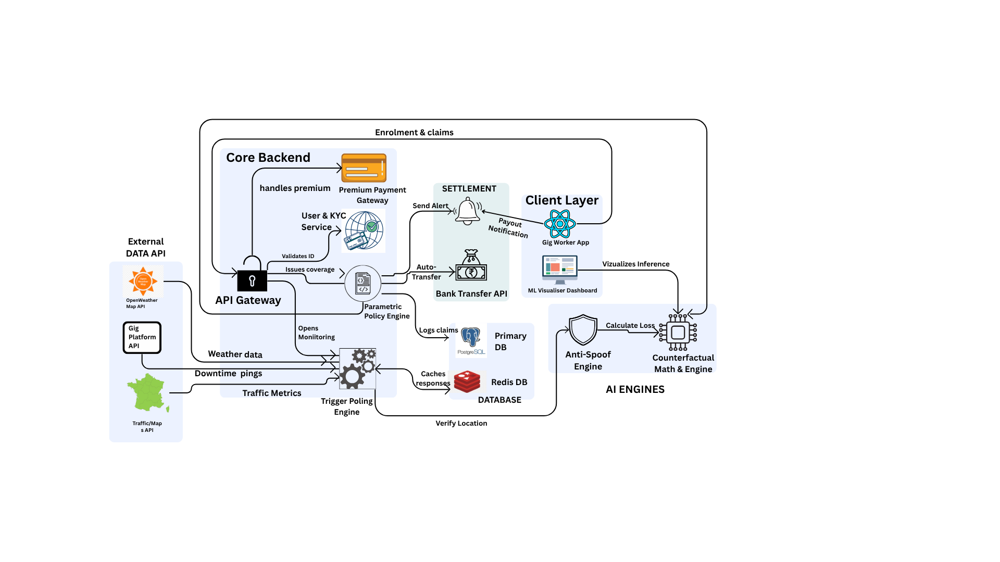

# 🛡️ InsureGig - AI-Powered Insurance for India's Gig Economy

> *trigger-based weekly insurance, Powered by AI*

---

## 📑 Table of Contents

1. [Project Overview](#project-overview)
2. [System Architecture](#system-architecture)
3. [Persona-Based Scenarios & Workflow](#persona-based-scenarios--workflow)
4. [Weekly Premium Model & Parametric Triggers](#weekly-premium-model--parametric-triggers)
5. [Platform Choice: Web vs. Mobile](#platform-choice-web-vs-mobile)
6. [AI/ML Integration](#aiml-integration)
7. [Tech Stack](#tech-stack)
8. [Development Plan](#development-plan)
9. [Additional Considerations](#additional-considerations)
10. [How to Run the Demo](#how-to-run-the-demo)
11. [Team & Contact](#team--contact)

---

## 📌 Project Overview

**InsureGig** is a micro-insurance platform designed specifically for **delivery partners and gig workers**. Unlike traditional insurance, this platform uses a **parametric model** — meaning claims are triggered automatically based on measurable, predefined conditions (like severe weather or server crashes), with zero paperwork and no lengthy claim process.

### Problem Statement

> *To protect gig workers' livelihoods from uncontrollable external disruptions (extreme weather, platform server outages, traffic gridlock, or hazardous AQI) that cause an immediate, unpredictable loss of their daily wages.*

### Solution

> *We offer a week premium plan where payouts are automatically triggered when specific parametric events occur (e.g., severe rainfall thresholds are crossed or API servers crash). The entire experience — from enrolment, live risk-assessment, to the instant automatic payout — happens directly via our Web App.*

---

## 🏗️ System Architecture



---

## 👤 Persona-Based Scenarios & Workflow

### Persona 1: Ravi — Traditional Gig Driver

| Attribute | Details |
|-----------|---------|
| **Name** | Ravi, 38 |
| **Occupation** | Two-Wheeler Delivery Partner (Zomato/Swiggy) |
| **Location** | Flood-prone Mumbai Suburb |
| **Tech Literacy** | Moderate — uses smartphone daily for maps and delivery apps |
| **Pain Point** | Extreme rain forces him offline for 2-3 days, resulting in zero income and no safety net |
| **Goal** | Affordable, hassle-free income protection during severe monsoons |

**Scenario:**
> *Ravi relies on daily deliveries to support his family. He signs up for GigInc using his Aadhaar, selecting a ₹35/week gig-insurance plan. Three weeks later, a severe monsoon hits Mumbai. The OpenWeatherMap API registers persistent rainfall exceeding safely drivable levels. The physical disruption threshold is crossed. Ravi receives a push notification and an automatic counterfactual payout of ₹530 directly into his wallet to cover his lost operational hours, without ever filing a physical claim.*

**Workflow:**

```text
[Enrolment] → [Profile & Asset/Location Verification] → [Plan Selection]
     → [Weekly Premium Payment] → [Continuous API Trigger Monitoring]
          → [Automatic Counterfactual Payout on Trigger] → [Feedback & Renewal]
```

---

### Persona 2: Meena — Multi-App Gig Worker

| Attribute | Details |
|-----------|---------|
| **Name** | Meena, 29 |
| **Occupation** | Gig Delivery Rider (Blinkit/Zepto) |
| **Location** | High-density Chennai Suburb |
| **Tech Literacy** | High — navigates multiple gig apps simultaneously |
| **Pain Point** | Sudden app server crashes leave her stranded with zero hourly earnings |
| **Goal** | Flexible, low-cost weekly coverage she can pause if she takes time off between jobs |

**Scenario:**
> *Meena is working the busy evening shift when her delivery platform's server suffers a major 4-hour global outage. She is unable to accept orders and loses her peak earning window. GigInc's backend is continuously polling the platform's API status. It detects the massive downtime. Using its ML demand model, GigInc immediately calculates the "income lost" percentage, approves the claim, and deposits the missing wages into her account automatically.*

**Workflow:**

```text
[App Onboarding] → [KYC via Aadhaar/DigiLocker] → [Select Weekly Plan]
     → [Auto-debit weekly payment] → [Platform Server API Trigger Detected]
          → [AI Predicts Lost Income & Auto-Pays] → [One-tap Renewal]
```

---

### General Application Workflow

```text
User Registration
      │
      ▼
Identity Verification (KYC)
      │
      ▼
Risk Profile Assessment (AI-powered Geographic GPS tags)
      │
      ▼
Plan Selection & Weekly Premium Quote
      │
      ▼
Payment (UPI / Wallet / Bank Auto-debit)
      │
      ▼
Active Coverage Period Begins
      │
      ▼
Parametric Trigger Monitoring (Real-time Live APIs)
      │
      ├── NO TRIGGER → Continue Coverage / Auto-renew
      │
      └── TRIGGER DETECTED → ML Validation → Anti-Fraud Spoof Check → Auto Payout
```

---

## 💰 Weekly Premium Model & Parametric Triggers

### Why Weekly?

> *Daily wage earners and gig workers earn irregularly — income varies day to day and week to week. A weekly premium of ₹25–₹40 removes the single biggest barrier to insurance adoption: upfront cost. Unlike annual or monthly plans that require a lump sum, weekly micro-premiums align with how this population actually earns and spends. Users can also pause or skip a week between jobs, making it flexible rather than a fixed obligation.*

### Premium Pricing Model

| Plan Tier | Weekly Premium | Coverage Amount | Target User |
|-----------|---------------|-----------------|-------------|
| Basic | ₹25 | ₹500/day | Part-time gig workers |
| Standard | ₹35 | ₹600/day | Full-time delivery riders |
| Premium | ₹40 | ₹700/day | Cab drivers & logistics partners |

**Premium Calculation Factors:**
- **Geographic Risk Zone:** Users in high-traffic or flood-prone districts pay a slightly adjusted rate based on the historical trigger frequency in that hex.
- **Disruption Type Selected:** Weather APIs (Rain/AQI) and Server downtime status APIs carry different historical frequencies and are priced accordingly.
- **Coverage Duration:** Users who maintain uninterrupted weekly coverage receive loyalty discounts to reduce churn.
- **Prior Payout History:** Users with no triggered payouts over a 6-month period receive a no-claim discount on renewal.

---

### Parametric Triggers

Unlike traditional insurance, **no claim filing is required**. Payouts are triggered automatically when live external APIs indicate a measurable condition crossed a defined threshold.

| Trigger Type | Data Source | Threshold Example | Payout Condition |
|---|---|---|---|
| Extreme Weather Event | OpenWeatherMap API | Sustained heavy rainfall in GPS zone | Full/Partial based on ML counterfactual loss % |
| App Server Outage | Platform Status APIs | > 1 hour of zero response / high latency | Paid proportionally for downtime length |
| Hazardous AQI | Pollution APIs | AQI > 400 for 24+ hours | Partial health-buffer payout |
| Gridlock / Traffic Halt| Google Maps / Traffic Sensors | Major arterial blockage over 3 hours | ML scales payout based on "Platform Demand Left" |

**Trigger Justification:**
- **Objective:** All triggers use third-party data (Live Weather APIs, Platform status) with no subjective judgment. The threshold is either crossed or it is not.
- **Directly tied to income loss:** Rain stops riders, servers crashing stops orders. The trigger is the loss event itself.
- **No Moral Hazard:** Payouts are driven by external data, not user-reported claims. Users cannot influence whether weather or API servers crash.
- **Fast Payout:** Full automation means funds reach the user within minutes.

---

## 📱 Platform Choice: Web vs. Mobile

**Chosen Platform: Web App (Progressive Web Application)**

| Criteria | Web App | Mobile App | Our Choice |
|----------|---------|------------|------------|
| Target user device access | ✅ Desktop & Mobile browser | ✅ Smartphone only | **Web App (React/Vite)** |
| Offline capability | ❌ Limited | ✅ Better via PWA/native | |
| Distribution | ✅ No app store needed | ❌ App store required | |
| Push Notifications | ❌ Limited | ✅ Native | |
| Development cost | ✅ Lower | ❌ Higher | |
| Scale & Hardware | ✅ Works on older low-end OS | ❌ Restrictive version reqs | |

**Justification:**
> *We chose a highly interactive Web App (via React and Vite) because our target users (gig workers) often use budget smartphones with limited storage. A web-based application eliminates the App Store download hurdle, runs on severely constrained hardware, easily taps into the HTML5 Geolocation API for real-time risk dashboards, and drastically reduces our development costs for the Phase 1 prototype.*

---

## 🤖 AI/ML Integration

### 1. Dynamic Counterfactual Payout Engine
**Model Type:** Random Forest Regressor
**Inputs:**
- Weather Severity % (from live APIs)
- Platform Demand Left % (from server pings)

**Output:** Predicts exact "Income Lost %" during the disruption event.

**Justification:** *Static pricing tables fail to capture how variable real-world disruptions are. An ML model gracefully predicts how badly a specific storm combined with a specific drop in app demand slashes a rider's daily earnings, ensuring they get paid the exact fair counterfactual amount.*

### 2. Live Anti-Fraud Spoofing Engine
**Model Type:** Heuristic Distance Variance + Location Cross-Verification
**Signals Monitored:**
- Raw HTML5 Device GPS Coordinates
- IP Address Geolocation matching

**Output:** Instantly rejects claims if a rider spoofs their GPS (e.g., claiming to be in a flooded area while their network IP resolves thousands of kilometers away in a different state).

### 3. Visualizations
**Approach:** We run a parallel Streamlit dashboard to allow complete transparency into the Random Forest. It exposes the feature importance graph, training dataset size (5,000 synthetic records), and allows manual slider manipulation to test payout thresholds seamlessly.

---

## 🛠️ Tech Stack

### Frontend
| Layer | Technology | Reason |
|-------|-----------|--------|
| UI Framework | React 18, TypeScript, Vite | Fast compilation, modern interactive ecosystem |
| Styling | TailwindCSS, Shadcn/ui | Beautiful, rapid, responsive, accessible components |
| Animations | Framer Motion | Provides micro-animations (crucial for premium UX) |

### AI/ML
| Component | Technology | Reason |
|-----------|-----------|--------|
| Model Training | Python, Pandas, Numpy, scikit-learn | Proven data science foundation for non-linear regression |
| Dashboards | Streamlit | Rapid creation of Machine Learning visualizers |
| Connectivity | Localtunnel / Ngrok | Exposing Colab/Streamlit services to the public web |

### Infrastructure & Integrations
| Component | Technology |
|-----------|-----------|
| Weather Data API | OpenWeatherMap API |
| Geolocation | HTML5 Geolocation API, IP-API |

---

## 🗓️ Development Plan

### Phase 1 — Foundation (Hackathon Prototype)
- [x] UI/UX wireframes tailored to gig workers
- [x] Front-end mapping and risk dashboard using Geolocation
- [x] Machine Learning counterfactual calculation (Streamlit + Random Forest)
- [x] Anti-Fraud Spoofing Engine

### Phase 2 — Core Backend Integration
- [ ] Connect production PostgreSQL Database
- [ ] Aadhaar eKYC via DigiLocker API
- [ ] Implement secure wallet Auto-Debit API (UPI)

### Phase 3 — Scale & Compliance
- [ ] IRDAI Regulatory Sandbox application
- [ ] Partner directly with a Licensed Insurer to hold risk

---

## 📎 Additional Considerations

### Regulatory & Compliance
*The platform will operate under the IRDAI Regulatory Sandbox framework, allowing us to pilot parametric insurance products before full licensing. We will partner with a licensed insurer as the risk carrier, with GigInc acting as the technology and distribution layer.*

### Data Privacy
> *All user PII is encrypted at rest and in transit. Location data collected by the Anti-Fraud engine is checked ephemerally to trigger payouts and discard. Aadhaar-based KYC follows UIDAI prescribed norms.*

### Financial Inclusion Goals
> *Our primary target is the gig workforce. The app interface relies heavily on iconography and clear visual indicators (like color-coded risk hexes) rather than dense text, catering to hurried riders in the field. Weekly micro-premiums ensure the program is financially accessible.*

---

## 🚀 How to Run the Demo

### Part 1: The React Prototype (Anti-Fraud & UX)
1. Install dependencies: `npm install`
2. Start the app: `npm run dev`
3. Navigate to `http://localhost:5173`

### Part 2: The ML Engine Visualizer (For Technical Judges)
We've provided two ways for technical judges to run and verify the underlying Machine Learning Math Engine:

**Method A: Google Colab (Zero-Setup - Recommended)**
1. Go to [Google Colab](https://colab.research.google.com/) and upload the `InsureGig_Colab.ipynb` file.
2. Run all cells. It will instantly generate a live, publicly accessible Localtunnel/Ngrok URL where judges can interact with the Random Forest sliders right in their browser!

**Method B: Run Locally**
1. `pip install -r ai_model/requirements.txt`
2. `streamlit run ai_model/streamlit_app.py`

---

## 👥 Team & Contact

| Name | Role | Contact |
|------|------|---------|
| Haina kumari | Tech Lead | hainakumari1@gmail.com |
| Bipin Kumar | Full Stack Development | bipinkumar620013@gmail.com |
| Dhanush Thirunavukkarasu | AI Development | dhanushthiru@proton.me |
| Harsh Thakur | UI/UX Design | harsh06072006@gmail.com


---

